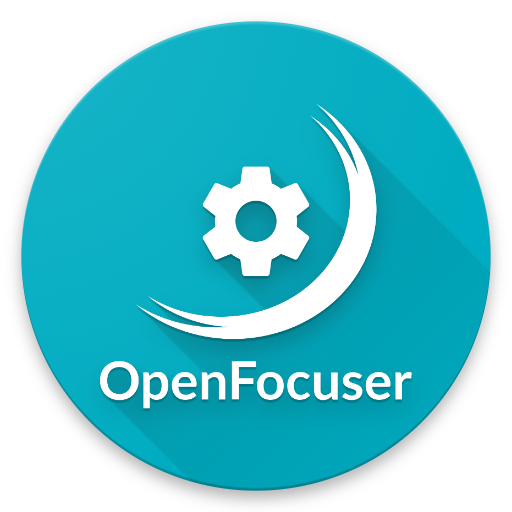
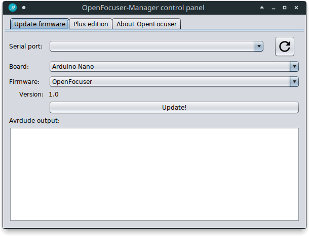
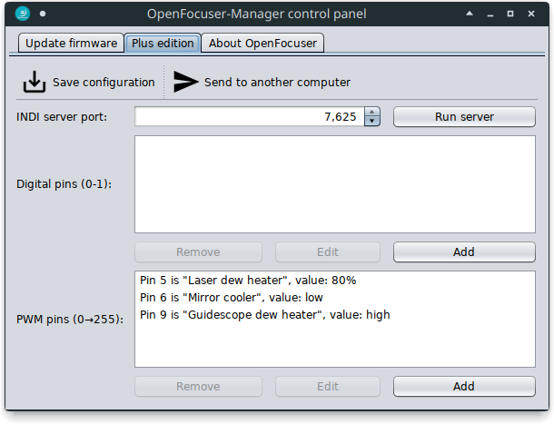
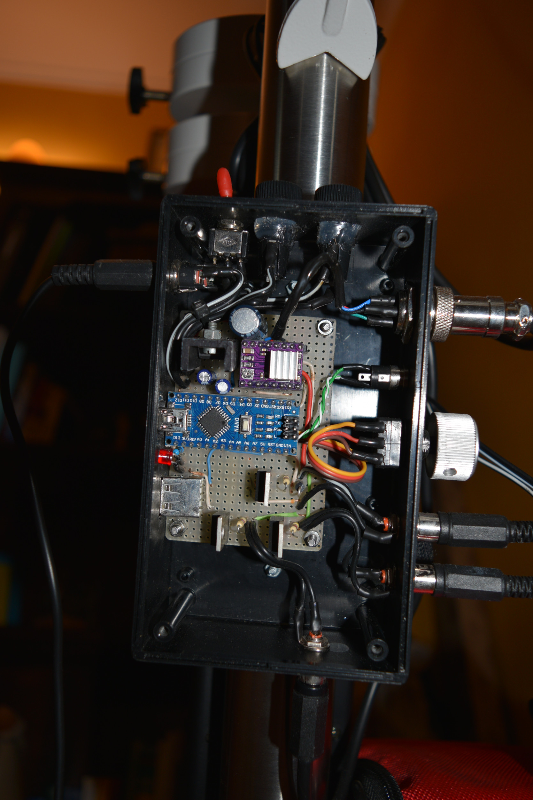

# OpenFocuser, un progetto di Marco Cipriani

**[Sito web](https://marcocipriani01.github.io/projects/OpenFocuser) |** Focheggiatore compatibile MoonLite con posizionamento assoluto e relativo, half e full step. Compatibile con Linux e MacOS (INDI) e Windows (ASCOM). Non supporta la compensazione per temperatura. Disponibile in due edizioni: standard e Plus, la quale supporta una funzione non-MoonLite per controllare tutti i pin digitali e PWM dell'Arduino, in modo da poter accendere, spegnere o regolare in corrente altri dispositivi come fasce anti condensa, ventole per specchi o Raspberry Pi direttamente dal computer, o in remoto con un server INDI.

<aside>

<b style="margin-left:16px;">Indice</b>

- [OpenFocuser, un progetto di Marco Cipriani](#openfocuser-un-progetto-di-marco-cipriani)
  - [Utilizzo](#utilizzo)
    - [Focheggiatore](#focheggiatore)
    - [OpenFocuser-Manager](#openfocuser-manager)
  - [Utilizzo avanzato e risoluzione dei problemi](#utilizzo-avanzato-e-risoluzione-dei-problemi)
    - [Inviare la configurazione ad un altro computer.](#inviare-la-configurazione-ad-un-altro-computer)
    - [Server stand-alone da riga di comando](#server-stand-alone-da-riga-di-comando)
    - [INDI driver da solo in un altro server INDI](#indi-driver-da-solo-in-un-altro-server-indi)
    - [Lanciare OpenFocuser dalla linea di comando](#lanciare-openfocuser-dalla-linea-di-comando)
    - [Errori frequenti](#errori-frequenti)
  - [Hardware](#hardware)
    - [Autodesk Eagle circuit](#autodesk-eagle-circuit)
    - [Motor holders](#motor-holders)
    - [Focuser motor and drivers](#focuser-motor-and-drivers)
  - [Guida allo sviluppo](#guida-allo-sviluppo)
    - [Licensa](#licensa)
    - [Creare opere derivate e contribuire](#creare-opere-derivate-e-contribuire)

</aside>

## Utilizzo

### Focheggiatore

OpenFocuser è completamente compatibile con software MoonLite, quindi fare riferimento alle guide officiali per MoonLite, INDI, KStars, ASCOM o qualunque altra piattaforma si usi per l'astrofotografia

### OpenFocuser-Manager

OpenFocuser-Manager è un'applicazione Java 12 che permette all'utente finale di aggiornare facilmente il firmware dell'Arduino (eliminando la necessità di installare l'intera IDE Arduino, compilare e caricare lo sketch) e controllare i pin digitali della scheda se si sta utilizzando l'edizione Plus. Contiene integrati `avrdude` e gli ultimi firmware `.hex` per Arduino Nano, librerie seriali, il server INDI4Java e utility di auto-aggiornamento.

#### Installazione

-   Debian e Ubuntu:
    -   Installare il pacchetto Debian: `dpkg` installerà automaticamente `socat` e `avrdude` per te, una icona desktop verrà creata e si è pronti per lavorare.
    -   I pacchetti `openssh-client` e `openssh-server` sono richiesti se si vogliono inviare i file di configurazione, vedere sotto per ulteriori informazioni.
-   Altre distribuzioni Linux:
    -   Scaricare l'archivio `jar` ed eseguirlo. `socat` e `avrdude` **devono** essere installati a seconda del package manager e nella path.
    -   `ssh` client e server sono richiesti se si vogliono inviare i file di configurazione, vedere sotto per ulteriori informazioni.
-   Windows:
    -   Scaricare l'archivio `jar` ed eseguirlo. `avrdude.exe` e `libusb0.dll` sono inclusi, non c'è bisogno di un'installazione aggiuntiva. Il server INDI, il driver e l'invio delle impostazioni non sono disponibili, solo firmware update.
-   MacOS: non possiedo un Mac, quindi non posso distribuire un pacchetto per questo sistema operativo. Sentiti libero di contribuire!

#### Aggiornare il firmware

L'aggiornamento del firmware con `avrdude` è supportato in Windows (`avrdude.exe` è  incluso nello `jar` e verrà spacchettato durante l'esecuzione nella cartella temporanea predefinita di sistema) e in Linux, indifferentemente dalla distribuzione, se `avrdude` è nella path (in Debian, installarlo con `sudo apt-get install avrdude`). La configurazione predefinita di `avrdude` è scelta automaticamente dal programma. 
Nella sezione Firmware update è possible selezionare la porta seriale della scheda, il tipo di scheda (al momento, il firmware è compilato solo per Arduino Nano, nuovo e vecchio bootloader), e l'edizione del firmware: standard (solo focheggiatore) o Plus (pin controllabili e illuminatore polare). Un'etichetta di testo sotto la selezione del firmware mostra la versione del software selezionato. Premere Update per eseguire il flash della scheda

#### Gestione dei pin nell'edizione Plus

**Nota: i focheggiatori standard non supportano la gestione dei pin! Non sono compatibili con OpenFocuser**
 Se si è nuovi ai driver INDI, leggere prima la documentazione sul <a href="http://indilib.org/about/discover-indi.html">sito INDI</a> e su <a href="https://en.wikipedia.org/wiki/Instrument_Neutral_Distributed_Interface">Wikipedia</a>.
 Nella sezione "Plus edition configuration" è possibile selezionare una porta per il server INDI (predefinita 7625 per lasciare la 7624 agli altri server INDI) e definire la lista dei pin digitali e PWM.
Premi "Add" per aggiungere una definizione di pin: aggiungere un pin digitale significa aggiungere un elemento switch INDI (una casella di selezione ON/OFF nel pannello di controllo INDI del client) che permette all'utente di cambiare lo stato del pin ON e OFF; invece, alla creazione di un pin PWM OpenFocuser aggiungerà un elemento INDI numerico al suo driver, permettendo all'utilizzatore di scrivere il valore del pin (0→100%) direttamente dal pannello di controllo INDI nel client.
Una porta pin verrà richiesta (per esempio, pin 13). **Nota: puoi aggiungere solo quei pin precedentemente selezionati nella configurazione dell'Arduino!**
È poi possibile premere "Edit" per modificare le proprietà del pin: un nome personalizzato (es. "Fascia anticondensa") e un valore predefinito, applicato quando si avvia il driver.
Dopo aver definito tutti i pin, salvare la configurazione ed avviare il server direttamente dal pannello di controllo o chiuderlo per avviarlo dalla linea di comando (si veda utilizzo avanzato).
Per utilizzare il manger dei pin è necessario un client INDI.
In KStars, aprire Ekos dalla toolbar e create un nuovo profilo contenente la tua montatura, CCD o Reflex e un focheggiatore MoonLite, e nel campo driver "Remote:" scrivere `INDI Arduino pin driver@localhost:7625`.
Cambiare `localhost:7625` con la giusta porta e host.
**Deselezionare** l'auto connessione dei dispositivi e dare al profilo un nome.
Ora avviare il server OpenFocuser (dal pannello di controllo o dalla linea di comando).
Avviare il server INDI di Ekos ed aprire il pannello di controllo INDI.
Collegare tutti i device, andare nella sezione "INDI Arduino pin driver" e connettere il driver.
Nella sottosezione "Serial connection" selezionare una porta seriale e connettere.
Una nuova scheda chiamata "Manage pins" comparirà, nella quale è possibile modificare lo stato dei pin selezionati nel pannello di controllo.
Copiare la porta del focheggiatore MoonLite ed incollarla nel campo della porta del driver MoonLite.
Selezionare come veloctà baud 9600 e connettere il focheggiatore.
Se tutto funziona a dovere l'intero pannello di controllo MoonLite comparirà.
Altrimentri controllare se il server OpenFocuser è in esecuzione, se la porta virtuale esiste e se la velocità è 9600.

## Utilizzo avanzato e risoluzione dei problemi

### Inviare la configurazione ad un altro computer.

È possibile inviare la configurazione dei pin e le impostazioni ad un altro computer. Assicurarsi che OpenFocuser-Manager sia installato su entrambi i computer con tutte le dipendenze. Dal computer che deve inviare la configurazione aprire il pannello di controllo e premere "Send configuration".
Verranno richiesti l'host remoto, l'username e la password.
Se il processo fallisce a causa di una cartella remota non trovata, aprire e chiudere una volta il pannello di controllo nel computer remoto e riprovare (questo ricreerà la cartella di configurazione nella cartella remota, che deve essere presente per permettere al primo computer di inviare il file di impostazioni).

### Server stand-alone da riga di comando

Usare `openfocuser -p=xxxx`, con `xxxx` la porta del server (o `0` per usare l'ultima porta salvata), per avviare il server da riga di comando senza interfaccia utente.
La configurazione è la stessa di quella salvata nel pannello di contrllo.

### INDI driver da solo in un altro server INDI

Il driver INDI può essere eseguito all'interno di un altro server INDI eseguiendo `openfocuser -d`.
Nessuna interfaccia utente verrà caricata e nessun server di OpenFocuser verrà eseguito: il driver comunicherà direttamente con lo standard input/output, come qualunque altro driver INDI.

### Lanciare OpenFocuser dalla linea di comando

-   `bash`: `openfocuser <options>`
-   Windows: `java -jar OpenFocuser-Manager.jar <options>`

| Opzione abbreviata | Opzione completa       | Parametri               | Description                                                                                           |
| ------------ | ----------------- | ------------------- | ----------------------------------------------------------------------------------------------------- |
| `-a`         | `--serial-port`   | es. `/dev/ttyUSB0` | Specifica la porta seriale e tenta una connessione. Altrimentri verrà solamente salvata nelle preferenze. |
| `-c`         | `--control-panel` |                     | Mostra il pannello di controllo.                                                                              |
| `-d`         | `--driver`        |                     | Modalità solo driver (no server, stdin/stdout)                                                            |
| `-p`         | `--indi-port`     | es. `7625`         | Modalità server in linea di comando. Se la porta specificata è 0, usare l'ultima.                  |
| `-v`         | `--verbose`       |                     | Log verbosi.                                                                                 |

### Errori frequenti

| Codice d'uscita | Errore                                  | Soluzione                                                                                                                                                                                                                   |
| --------- | -------------------------------------- | -------------------------------------------------------------------------------------------------------------------------------------------------------------------------------------------------------------------------- |
| 0         | Java non trovato                         | Installare Java >12 e controllare che sia nella path.                                                                                                                                                                                    |
| 3         | `socat` non trovato                      | Installare `socat` (Linux)                                                                                                                                                                                                    |
| 4         | INDI non trovato                         | Installare il pacchetto `indiserver` (Linux)                                                                                                                                                                                               |
| 5         | `avrdude` non trovare                    | Installare il pacchetto `avrdude` (Linux)                                                                                                                                                                                                  |
| 6         | `jar` non trovato                        | Controllare la cartella di esecuzione, il progetto e se l'installazione è integra.                                                                                                                                      |
| 8         | Impossibile impostare la cartella delle impostazioni | OpenFocuser-Manager non è riuscito a creare la cartella dove salvare le impostazioni. Usando il file manager di sistema, andare nella cartella utente e controllare se la cartella `.config/OpenFocuser-Manager` esiste ed è una cartella. |
| 9         | Impossibile interpretare i parametri             | Controlla i parametri della linea di comando.                                                                                                                                                                                           |
| 10        | Opzioni non valide                        | Combinazione non valida di parametri di linea di comando (ad esempio, non si può eseguire il driver insieme al server, né il pannello di controllo con gli altri due).                                                                     |
| 11        | Errore di `socat`                          | Non è stato possibile avviare `socat`. Controllare che sia installato, aggiornato e nella path. Nessuna soluzione per sistemi operativi diversi da Linux, anche se non dovrebbe succere su Windows: se accade ciò, riportare l'errore allo sviluppatore.                                            |

## Hardware

### Autodesk Eagle circuit

In the "Eagle" directory you can find the full circuit project, both schematics and PCB for the standard and Plus editions.
Feel free to modify it to accomplish your necessities: for example, you could add another dew heater controller, or remove the Newton mirror cooler MOSFET.
 **Made with Eagle 9.4.1 Premium**

### Motor holders

I included the mounting brackets I made for the common SkyWatcher
Dual-Speed Crayford focuser (I have a 200mm f/5 Newton OTA).
 **AutoCAD 2019** project, STL and IGS exported files ready for 3D printing.

### Focuser motor and drivers

I use a Nema 11 motor that moves the focuser knob using a belt.
If you don't have a heavy focuser, also consider using a Nema 8.
A 20 teeth pulley and a 6mm wide 160mm long belt are enough.
Supported motor drivers via the [StepperDriver](https://github.com/laurb9/StepperDriver) library:

-   Generic 2-pin drivers
-   DRV8825
-   A4988
-   DRV8834

# Guida allo sviluppo
Vedere guida inglese.

## Licensa

OpenFocuser è un progetto di Marco Cipriani - [GitHub](https://github.com/marcocipriani01) - [sito web](https://marcocipriani01.github.io/)
 Licensed under the [Apache License, Version 2.0](LICENSE.md)
 Google, The Apache Software Foundation, Java, GitHub and MoonLite trademarks belong to their respective owners. I'm not affiliated with these manufacturers, companies and software foundations.

## Creare opere derivate e contribuire

Sentiti libero di inviare richieste di pull, riportare errori o suggerire nuove funzionalità da implementare! Inoltre, nuove staffe per motori sono le benvenute!
